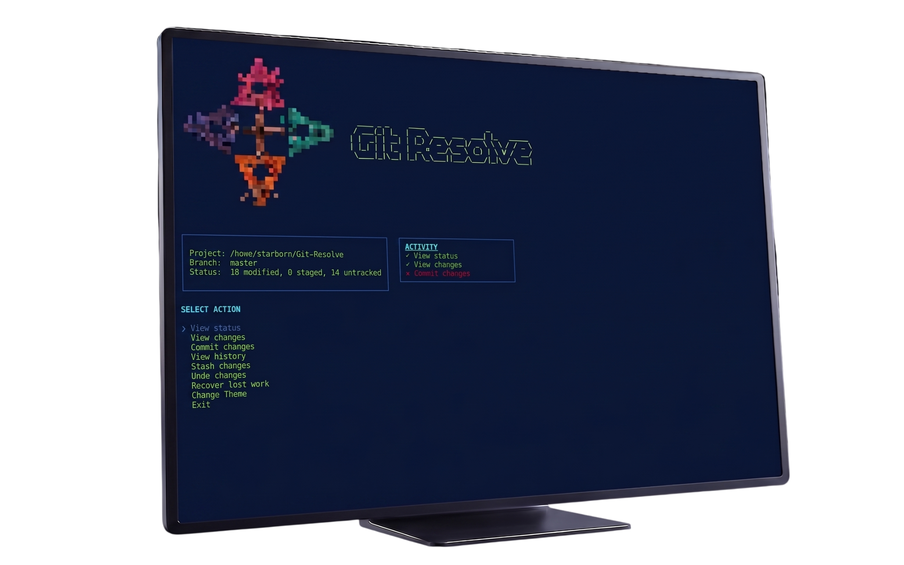

```text
  ____ _ _     ____                _           
 / ___(_) |_  |  _ \ ___  ___  ___| |_   _____ 
| |  _| | __| | |_) / _ \/ __|/ _ \ \ \ / / _ \
| |_| | | |_  |  _ <  __/\__ \ (_) | \ V /  __/
 \____|_|\__| |_| \_\___||___/\___/|_|\_/ \___|
```
                                                                                                            
                                                                                                            
> 𝒔𝒂𝒇𝒆, 𝒊𝒏𝒕𝒆𝒏𝒕-𝒅𝒓𝒊𝒗𝒆𝒏, 𝒍𝒐𝒄𝒂𝒍-𝒐𝒏𝒍𝒚 𝒈𝒊𝒕 𝒘𝒐𝒓𝒌𝒇𝒍𝒐𝒘𝒔.


<div align="center">

<a href="https://github.com/StarBorn1v1/Git-Resolve/releases/latest">
  
</a>
<a href="https://discord.com/invite/4DNhRb87my">
  
</a>

<br/><br/>

# Git Resolve

### *An intent-driven, local-only Git TUI that protects users from unsafe operations.*

<p>
  <a href="#features">Features</a> ·
  <a href="#how-it-works">How It Works</a> ·
  <a href="#safety">Safety</a> ·
  <a href="#development-environment">Development</a> ·
  <a href="#license">License</a>
</p>

<p>
  <a href="https://github.com/StarBorn1v1/Git-Resolve/stargazers">
    
  </a>
  <a href="https://github.com/StarBorn1v1/Git-Resolve/network/members">
    
  </a>
  <a href="https://github.com/StarBorn1v1/Git-Resolve/blob/main/LICENSE">
    
  </a>
  <a href="https://github.com/StarBorn1v1/Git-Resolve/releases/latest">
    
  </a>
</p>

</div>


𝙂𝙄𝙏 𝙍𝙀𝙎𝙊𝙇𝙑𝙀 𝙄𝙎 𝘼 𝙇𝙄𝙂𝙃𝙏𝙒𝙀𝙄𝙂𝙃𝙏, 𝙄𝙉𝙏𝙀𝙉𝙏-𝘿𝙍𝙄𝙑𝙀𝙉 𝙏𝙀𝙍𝙈𝙄𝙉𝘼𝙇 𝙐𝙎𝙀𝙍 𝙄𝙉𝙏𝙀𝙍𝙁𝘼𝘾𝙀 (𝙏𝙐𝙄) 𝘿𝙀𝙎𝙄𝙂𝙉𝙀𝘿 𝙏𝙊 𝙎𝙄𝙈𝙋𝙇𝙄𝙁𝙔 𝙇𝙊𝘾𝘼𝙇 𝙂𝙄𝙏 𝙒𝙊𝙍𝙆𝙁𝙇𝙊𝙒𝙎 𝘼𝙉𝘿 𝙋𝙍𝙊𝙏𝙀𝘾𝙏 𝙔𝙊𝙐 𝙁𝙍𝙊𝙈 𝘿𝘼𝙉𝙂𝙀𝙍𝙊𝙐𝙎 𝙈𝙄𝙎𝙏𝘼𝙆𝙀𝙎.

𝙄𝙉𝙎𝙏𝙀𝘼𝘿 𝙊𝙁 𝘿𝙍𝙊𝙋𝙋𝙄𝙉𝙂 𝙄𝙉𝙏𝙊 𝘼 𝙏𝙀𝙍𝙈𝙄𝙉𝘼𝙇 𝘼𝙉𝘿 𝘾𝙃𝘼𝙄𝙉𝙄𝙉𝙂 𝙂𝙄𝙏 𝘾𝙊𝙈𝙈𝘼𝙉𝘿𝙎, 𝙂𝙄𝙏 𝙍𝙀𝙎𝙊𝙇𝙑𝙀 𝘼𝘾𝙏𝙎 𝘼𝙎 𝘼 𝙎𝘼𝙁𝙀𝙏𝙔 𝙂𝙐𝘼𝙍𝘿 𝙁𝙊𝙍 𝙔𝙊𝙐𝙍 𝙍𝙀𝙋𝙊𝙎𝙄𝙏𝙊𝙍𝙔. 𝙄𝙏 𝙈𝘼𝙋𝙎 𝙊𝙐𝙏 𝙔𝙊𝙐𝙍 𝙐𝙉𝙎𝙏𝘼𝙂𝙀𝘿 𝘾𝙃𝘼𝙉𝙂𝙀𝙎, 𝙃𝘼𝙉𝘿𝙇𝙀𝙎 𝙎𝙏𝘼𝙎𝙃𝙄𝙉𝙂 𝘼𝙐𝙏𝙊𝙈𝘼𝙏𝙄𝘾𝘼𝙇𝙇𝙔, 𝘼𝙉𝘿 𝙂𝙄𝙑𝙀𝙎 𝙔𝙊𝙐 𝘼 𝙎𝙏𝙍𝘼𝙄𝙂𝙃𝙏𝙁𝙊𝙍𝙒𝘼𝙍𝘿 𝙒𝘼𝙔 𝙏𝙊 𝙈𝘼𝙉𝘼𝙂𝙀 𝙔𝙊𝙐𝙍 𝙃𝙄𝙎𝙏𝙊𝙍𝙔.


<p align="center">
  
</p>

## Download

### Node.js

**Git Resolve v1.0.0** is currently distributed via NPM for cross-platform usage.

[Download Git Resolve on GitHub](https://github.com/StarBorn1v1/Git-Resolve/releases)

#### Target Environments

The CLI is intended for modern Node.js environments across all major operating systems:

- Linux
- macOS
- Windows

> **Runtime:** Node.js v18+  
> **Package:** NPM / NPX  
> **Release:** v1.0.0

## The Natural Git Workflow

Git Resolve structures your commands into a top-to-bottom natural progression:

1. **View status** *(Where am I?)* 
2. **View changes** *(What did I do?)* 
3. **Commit changes** *(Save my work)*
4. **Sync with remote** *(Pull/Push to team)*
5. **View history** *(Look back at the log)* 
6. **Stash changes** *(Set things aside)*
7. **Undo changes** *(Throw things away)*
8. **Recover lost work** *(Oh no, undo my undo!)*
9. **Change Theme**

## Features

- **Local Git Overview:** The central hub visualizes your repository's state (branch, modified/staged/untracked files).
- **Intent-Driven Actions:** Execute human-readable actions like "View changes" or "Commit changes" instead of memorizing raw Git syntax.
- **Auto-Safety Stashing:** Destructive actions like "Undo changes" automatically create a background stash (`AUTO-SAVE`) before wiping your working tree, protecting you from accidental data loss.
- **Interactive Recovery:** Access the Git reflog in a clean, human-readable format to effortlessly recover lost commits or states.
- **State Guards:** Actions intelligently disable themselves if your working tree is clean or if the repository isn't ready.
- **Customizable Themes:** Terminal-native themes (Classic, Midnight, Amber, Matrix) to match your aesthetic.

## Why Git Resolve Exists

Developers frequently battle Git's complex, sharp-edged CLI when all they want to do is simply stash some files or undo a mistake. 

While traditional terminal commands are powerful, they are unforgiving. Git Resolve exists to provide a visual, safe layer over local repository management. It doesn't handle remotes or network authentication—it strictly focuses on making your local commit, stash, and undo operations instantly visible and 100% safe.

## How It Works

Git Resolve securely queries the local `.git` directory using `simple-git`. 

* **The Hub:** The main screen reads the repository status, current branch, and changed files.
* **The Actions:** A list of intent-driven operations dynamically enables/disables based on whether your working tree is clean or dirty.
* **The Briefing:** Selecting an action pulls up a Briefing panel, explaining exactly what will happen and which files will be affected before execution.

## Safety 

**Caution:** Git Resolve provides powerful features to reset your working tree. 

To prevent data loss, Git Resolve implements a **State Guard** pattern. When executing a destructive operation (like Undoing Changes), Git Resolve will automatically create an untracked safety stash *before* executing the `git reset --hard`. If you make a mistake, you can always recover your work from the stash or the "Recover lost work" menu.

## Development Environment

- Node.js (TypeScript + React Ink)

### Requirements

- Node.js v18+
- NPM

### Setup

\`\`\`bash
# Clone the repository
git clone https://github.com/StarBorn1v1/Git-Resolve.git
cd Git-Resolve

# Install dependencies
npm install

# Build the project
npm run build

# Launch the application
npm start
\`\`\`

## Future Distribution

Currently, Git Resolve is built for Node environments. Future distribution targets may include:

* Global NPM Package (\`npm install -g git-resolve\`)
* Standalone binary via \`pkg\` or \`bun build\`

## License

Git Resolve is open-source software licensed under the [MIT License](LICENSE).
